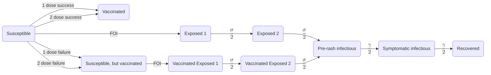

# A stochastic SEIRV metapopulation model in python

⚠️ This is a work in progress

## Package features

* Stochastic SEIRV model
* A model capable of handling flexible numbers of groups (e.g., age classes or connected populations) that is changeable using the config
* Intervention strategies common for measles: pre-introduction vaccination, active vaccination, and quarantine and isolation of infectious populations
* Interactive outbreak simulators built in `streamlit` and using the `metapop` package to model transmission dynamics

## Getting started

* Enable [poetry](https://python-poetry.org/) with `poetry install` and then start a poetry environment by activating the virtual environment: `source $(poetry env info --path)/bin/activate`
* **Run the one population app locally** using Streamlit with `make run_app`. To run the advanced app modeling the transmission dynamics between 3 connected populations, use `make run_advanced_app`. The advanced app is not up to date with all of the latest features in the model and may not yet have all model parameters available for users to modify.
* Run the example in `scripts/connectivity` exploring the impact of changing connectivity patterns and initial vaccine coverage with `python scripts/connectivity/simulate.py`. This will produce output in the `output` folder. Visualization and summary statistic tables for these results can be made with `Rscript scripts/connectivity/make_plots.R`.
* We also provide examples exploring other features in the model. The subfolder `scripts/interventions` contains an example exploring the impact of active vaccination and isolation in 3 connected populations. The subfolder `scripts/onepop` contains an example exploring these interventions in a single population.

## Model details

* The model is built using the `metapop` package, which allows for the modeling of multiple groups with different epidemiological characteristics. The model is built using a discrete time step and uses a stochastic approach to simulate the spread of disease.

* The model has the following compartments:
  * S: Susceptible
  * V: Vaccinated
  * SV: Susceptible, but vaccinated
  * E1: Exposed 1
  * E2: Exposed 2
  * E1_V: Exposed 1 and vaccinated
  * E2_V: Exposed 2 and vaccinated
  * I1: Infected and infectious, pre-rash
  * I2: Infected and infectious, symptomatic with rash
  * R: Recovered
  * Y: Tracks cumulative infections
  * X: Tracks cumulative vaccinations administered

We model two exposed compartments and two infectious compartments to reduce variation in the incubation and infectious periods and to facilitate modeling interventions which are deployed at particular times during the infection progression.

* Modeled interventions:
  * Pre-introduction vaccination: Vaccination of susceptible individuals before the introduction of the disease. This is modeled as a proportion of the population that is vaccinated with 2 doses of MMR vaccine. Users can specify the efficacy of 2 doses of MMR vaccine; current data put this estimate at 97% efficacy [(Measles (Rubeola) Factsheet | CDC)](https://www.cdc.gov/measles/vaccines/index.html?CDC_AA_refVal=https%3A%2F%2Fwww.cdc.gov%2Fvaccines%2Fvpd%2Fmmr%2Fpublic%2Findex.html).
  * Active vaccination: Vaccination of susceptible individuals after the introduction of the disease. This is modeled as a proportion of the susceptible population that is vaccinated with 1 dose of MMR vaccine over the vaccination campaign. Users can specify the timing of the vaccination campaign and the proportion of the susceptible population that is vaccinated. Users can also specify the efficacy of 1 dose of MMR vaccine; current data put this estimate at 93% efficacy [(Measles (Rubeola) Factsheet | CDC)](https://www.cdc.gov/measles/vaccines/index.html?CDC_AA_refVal=https%3A%2F%2Fwww.cdc.gov%2Fvaccines%2Fvpd%2Fmmr%2Fpublic%2Findex.html). We assume that people will get vaccinated once in the active vaccination campaign, but the vaccination may not be successful in conferring immunity. By tracking them, we can model these dynamics more accurately and model the administration of vaccines only to people who have not yet received a vaccine. We assume that both susceptible and exposed individuals who are not yet infectious are eligible to get vaccinated during the vaccination campaign. We also assume that exposed individuals are not yet aware of their exposure status and so they are equally likely to seek vaccination. After vaccination, only susceptible individuals may become immune, and we allow for the possibility of vaccine failure (SV). Exposed individuals remain in the exposed state and continue with infection progression as normal. The number of doses administered may be lower than the number of doses scheduled if by the time of the campaign, the daily dose rate scheduled exceeds the number of individuals eligible for vaccination or if the vaccination schedule extends beyond the simulation.
  * Quarantine and isolation: Quarantine is modeled as a proportion of pre-symptomatic infectious individuals that are isolated. Isolation is modeled as a proportion of symptomatic infectious individuals that are isolated. Users can specify the timing of the quarantine and isolation campaigns and the proportion of the population that is quarantined or isolated. Users can also specify the efficacy of quarantine and isolation.

## Running with a flexible number of compartments

* The `metapop` package can currently support the modeling of infectious disease transmission in 1 or 3 groups. Groups represent populations with different epidemiologically relevant characteristics such as age classes or connected populations. To model a single population or 3 connected populations, you can change the number of groups by modifying the config file (`scripts/config.yaml`).
* For example, if we wanted 3 groups, we could specify `n_groups: 3` and then modify other parameters defining conditions for the populations: `popsizes: [300, 200, 100]` for population sizes, `I0: [0, 5, 2]` to specify the number of infected people introduced into each population at the start of the simulation, `k_i: [10, 15, 10]` for the average degree per person in each population, etc. The parameters `k_g1`, `k_g2`, `k_21` define connectivity rates between groups: `k_ij` is the number of contacts the average person in group j makes with others in group i. These parameters define the contact matrix between populations (constructed through the method `get_per_capita_contact_matrix`).
* Similarly for a single population, we can build the model by setting `n_groups: 1`, `popsizes: [5000]` for the population size, `I0: 5`, `k_i: [10]`, etc. In this case, the contact matrix is equivalent to `k_i`.
* As a work in progress, we are working to add functionality that will allow users to give a contact matrix of their choice and model a flexible number of groups that mapped to the contact matrix.

## CDC simulator link
For those less familiar with Python, we host an interactive application of the metapop model for a single well-mixed (or homogeneous) population at [https://cdcposit.cdc.gov/measles-simulator](https://cdcposit.cdc.gov/measles-simulator) as CDC's first interative disease simulator. Check it out and let us know what you think at Contact.CFA@cdc.gov.

## Local app
Users can also run our interactive application of the metapop model locally using Streamlit with `make run_app` at the command line. This will launch an application that models transmission dynamics of measles introductions into a single well-mixed (or homogeneous) population. A prototype of this application is available to model the transmission dynamics of 3 connected populations, though it is still in beta mode. To run this version, use `make run_advanced_app` at the command line.

## Stlite app
You can run the app in-browser only based on [stlite](https://github.com/whitphx/stlite).  Within the repo, you can load `stlite/index.html` directly in your browser.  To build a sharable version of the one population app, run `make build_stlite_app` which will create `stlite/measles_sim.html` which can be shared and requires the internet but no access to internal resources nor to a server.  Note that `pygriddler` required removal of `progressbar` for compatibility with `pyodide`/`stlite`.

## Project Admin
* Paige Miller, yub1@cdc.gov (CDC/IOD/ORR/CFA)
* Kate Hudson, ryl8@cdc.gov (CDC/IOD/ORR/CFA)
* Beau B. Bruce, lue7@cdc.gov (CDC/IOD/ORR/CFA) for the [stlite](https://github.com/whitphx/stlite)
* Dina Mistry, uqx8@cdc.gov (CDC/IOD/ORR/CFA)

## Authors
* Paige Miller
* Theresa Sheets
* Will Koval
* Inga Holmdahl
* Rebecca Kahn
* Beau B. Bruce
* Kate Hudson
* Dina Mistry

## Contributors
* Paul Gastanaduy
* Matt Biggerstaff
* Rachel Slayton
* Harris Temuri
* Martin Frigaard
* Nimeshkumar Patel
* Prabasaj Paul
* Isaac Ghinai
* Michael Cima
* Sarah Connolly
* Gil Sharon
* Scott Oleson
* Danielle Richard

## General Disclaimer
This repository was created for use by CDC programs to collaborate on public health related projects in support of the [CDC mission](https://www.cdc.gov/about/organization/mission.htm).  GitHub is not hosted by the CDC, but is a third party website used by CDC and its partners to share information and collaborate on software. CDC use of GitHub does not imply an endorsement of any one particular service, product, or enterprise.

## Public Domain Standard Notice
This repository constitutes a work of the United States Government and is not
subject to domestic copyright protection under 17 USC § 105. This repository is in
the public domain within the United States, and copyright and related rights in
the work worldwide are waived through the [CC0 1.0 Universal public domain dedication](https://creativecommons.org/publicdomain/zero/1.0/).
All contributions to this repository will be released under the CC0 dedication. By
submitting a pull request you are agreeing to comply with this waiver of
copyright interest.

## License Standard Notice
This repository is licensed under ASL v2 or later.

This source code in this repository is free: you can redistribute it and/or modify it under
the terms of the Apache Software License version 2, or (at your option) any
later version.

This source code in this repository is distributed in the hope that it will be useful, but WITHOUT ANY
WARRANTY; without even the implied warranty of MERCHANTABILITY or FITNESS FOR A
PARTICULAR PURPOSE. See the Apache Software License for more details.

You should have received a copy of the Apache Software License along with this
program. If not, see http://www.apache.org/licenses/LICENSE-2.0.html

The source code forked from other open source projects will inherit its license.

## Privacy Standard Notice
This repository contains only non-sensitive, publicly available data and
information. All material and community participation is covered by the
[Disclaimer](https://github.com/CDCgov/template/blob/master/DISCLAIMER.md)
and [Code of Conduct](https://github.com/CDCgov/template/blob/master/code-of-conduct.md).
For more information about CDC's privacy policy, please visit [http://www.cdc.gov/other/privacy.html](https://www.cdc.gov/other/privacy.html).

## Contributing Standard Notice
Anyone is encouraged to contribute to the repository by [forking](https://help.github.com/articles/fork-a-repo)
and submitting a pull request. (If you are new to GitHub, you might start with a
[basic tutorial](https://help.github.com/articles/set-up-git).) By contributing
to this project, you grant a world-wide, royalty-free, perpetual, irrevocable,
non-exclusive, transferable license to all users under the terms of the
[Apache Software License v2](http://www.apache.org/licenses/LICENSE-2.0.html) or
later.

All comments, messages, pull requests, and other submissions received through
CDC including this GitHub page may be subject to applicable federal law, including but not limited to the Federal Records Act, and may be archived. Learn more at [http://www.cdc.gov/other/privacy.html](http://www.cdc.gov/other/privacy.html).

## Records Management Standard Notice
This repository is not a source of government records but is a copy to increase
collaboration and collaborative potential. All government records will be
published through the [CDC web site](http://www.cdc.gov).
